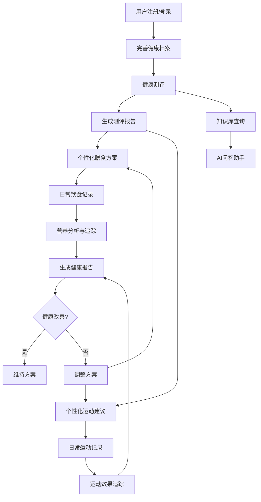

## 1. 产品概述

NutriHealth Pro 是一款面向普通人群和特殊人群的专业营养健康管理平台，提供智能健康测评、个性化膳食规划、运动建议、健康知识查询及个人健康评估报告等核心功能，帮助用户实现长期健康管理目标。

- 核心定位：AI驱动的营养健康咨询与管理系统，覆盖健康测评→膳食规划→运动建议→知识查询→报告输出的完整闭环
- 目标用户：18-65岁普通成年人、孕妇、老年人、慢性病患者等特殊人群，以及营养师等专业人士

## 2. 核心功能

### 2.1 用户角色

| 角色 | 注册方式 | 核心权限 |
|------|----------|----------|
| 普通用户 | 邮箱/手机号注册 | 健康测评、膳食规划、运动建议、知识查询、报告查看 |
| 管理员 | 系统分配 | 用户管理、内容管理、数据看板、系统配置 |

### 2.2 功能模块

1. **首页仪表盘**: 健康概览、今日饮食进度、运动目标、快捷入口、健康提醒
2. **用户中心**: 注册登录、个人资料、健康档案、会员信息、隐私设置
3. **健康测评**: 通用测评、孕妇测评、老年测评、慢病风险评估、测评历史
4. **膳食规划**: 膳食记录、营养分析、个性化食谱推荐、膳食方案生成、食材替换
5. **运动建议**: 运动能力评估、运动处方生成、运动记录、运动效果追踪
6. **知识库**: 知识分类、文章浏览、智能搜索、AI问答助手
7. **健康报告**: 日报/周报/月报、健康趋势图、改善建议、PDF导出
8. **管理后台**: 用户管理、内容管理、食谱管理、数据看板、系统配置

### 2.3 页面详情

| 页面名称 | 模块名称 | 功能描述 |
|----------|----------|----------|
| 首页仪表盘 | 健康概览卡片 | BMI指数、健康评分、营养达标率、运动完成率 |
| 首页仪表盘 | 今日饮食进度 | 三餐记录状态、热量摄入进度条、营养素分布图 |
| 首页仪表盘 | 快捷操作入口 | 快速记录饮食、开始测评、查看报告、AI问答 |
| 用户中心 | 注册/登录 | 邮箱注册、手机号注册、密码登录、验证码登录 |
| 用户中心 | 个人资料 | 头像、昵称、性别、年龄、身高、体重编辑 |
| 用户中心 | 健康档案 | 病史、过敏史、家族病史、体检数据管理 |
| 健康测评 | 测评首页 | 测评类型选择卡片、历史测评记录、推荐测评 |
| 健康测评 | 测评问卷 | 动态问卷引擎、进度指示、即时反馈 |
| 健康测评 | 测评结果 | 雷达图评分、风险等级、改善建议、营养目标 |
| 膳食规划 | 膳食记录 | 搜索添加食物、手动录入、份量调整、营养实时计算 |
| 膳食规划 | 营养分析 | 每日/每周营养摄入分析、目标对比、营养缺口提示 |
| 膳食规划 | 食谱推荐 | 个性化推荐列表、食谱详情、营养匹配度、收藏 |
| 膳食规划 | 膳食方案 | 周期性饮食计划生成、三餐分配、购物清单 |
| 运动建议 | 运动评估 | 运动习惯问卷、体能评估、运动能力分级 |
| 运动建议 | 运动处方 | 个性化运动计划、运动强度、频率、时长建议 |
| 运动建议 | 运动记录 | 运动类型选择、时长记录、卡路里消耗计算 |
| 知识库 | 知识首页 | 分类导航、热门文章、推荐内容、搜索入口 |
| 知识库 | 文章详情 | 富文本内容、相关推荐、收藏分享 |
| 知识库 | AI问答 | 对话式问答、上下文理解、引用来源、推荐问题 |
| 健康报告 | 报告列表 | 日报/周报/月报切换、报告卡片、生成状态 |
| 健康报告 | 报告详情 | 多维度图表、趋势分析、改善建议、PDF导出 |
| 管理后台 | 数据看板 | 用户统计、业务指标、趋势图表、实时数据 |
| 管理后台 | 用户管理 | 用户列表、搜索筛选、详情查看、状态管理 |
| 管理后台 | 内容管理 | 文章CRUD、分类管理、标签管理、发布审核 |
| 管理后台 | 食谱管理 | 食谱CRUD、营养数据、分类标签、批量导入 |

## 3. 核心流程

用户注册后，通过健康测评建立个人健康基线，系统基于测评结果生成个性化膳食方案和运动建议，用户日常记录饮食和运动数据，系统持续分析并生成健康报告，形成"测评→规划→执行→追踪→优化"的闭环管理。

## 4. 用户界面设计

### 4.1 设计风格

- 主色调：翡翠绿 (#10B981) — 代表健康与生命力，搭配深绿色 (#065F46) 作为强调色
- 辅助色：暖橙色 (#F59E0B) 用于提醒和重点标注，浅灰 (#F3F4F6) 作为背景
- 按钮风格：圆角 (rounded-xl)，主按钮带微妙阴影和hover渐变效果
- 字体：Noto Sans SC（中文）+ DM Sans（英文/数字），标题加粗，正文常规
- 布局风格：左侧固定导航栏 + 右侧内容区，卡片式布局，大量留白
- 图标风格：Lucide Icons 线性图标，与文字搭配使用
- 数据可视化：ECharts 图表，采用与主题一致的配色方案

### 4.2 页面设计概览

| 页面名称 | 模块名称 | UI元素 |
|----------|----------|--------|
| 首页仪表盘 | 健康概览 | 顶部4个统计卡片(渐变背景+图标)，中间饮食进度环形图+运动完成条，底部快捷操作按钮组 |
| 健康测评 | 测评问卷 | 顶部进度条，中间单题卡片式展示(选项按钮组/滑块/输入框)，底部上一步/下一步按钮 |
| 膳食规划 | 膳食记录 | 左侧日期选择+餐次Tab，右侧食物搜索+已添加列表，底部营养汇总条 |
| 知识库 | AI问答 | 左侧对话列表，右侧聊天界面(气泡样式)，底部输入框+发送按钮 |
| 健康报告 | 报告详情 | 顶部报告摘要卡片，中间多图表区域(折线图/雷达图/柱状图)，底部建议列表+导出按钮 |
| 管理后台 | 数据看板 | 顶部指标卡片行，中间趋势图+饼图并排，底部数据表格 |

### 4.3 响应式设计

- 桌面优先设计，最小宽度1280px完整展示
- 平板端(768-1280px)侧边栏折叠为图标模式
- 移动端(<768px)侧边栏隐藏，改为底部Tab导航

### 4.4 动效设计

- 页面切换：淡入淡出 + 轻微上移
- 卡片hover：阴影加深 + 轻微上浮
- 数据加载：骨架屏占位
- 图表渲染：渐进式动画
- 按钮点击：涟漪效果
