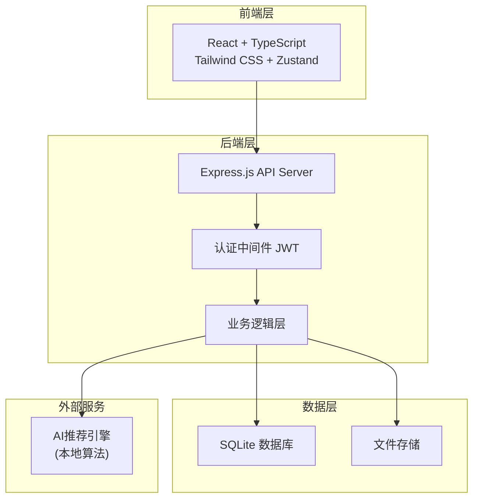
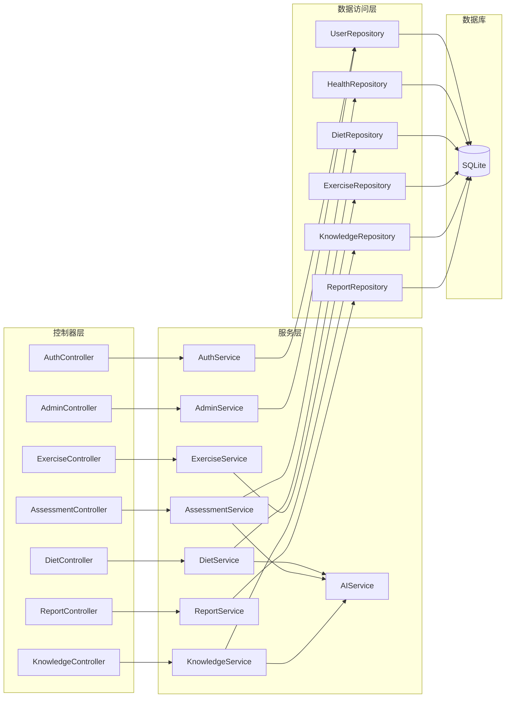
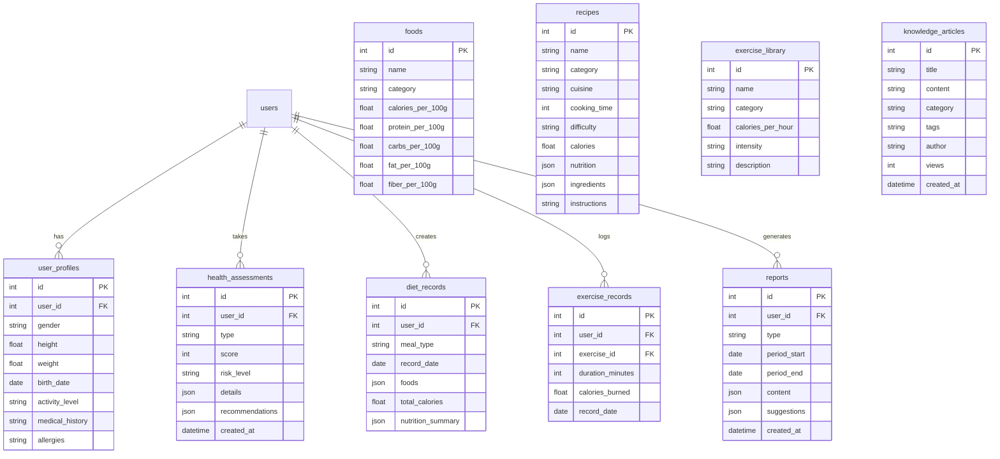

## 1. 架构设计



## 2. 技术说明

- 前端: React@18 + TypeScript + Tailwind CSS@3 + Vite + Zustand + ECharts
- 初始化工具: vite-init (react-express-ts 模板)
- 后端: Express@4 + TypeScript (ESM格式)
- 数据库: SQLite (better-sqlite3)，内置丰富初始数据
- 图标库: lucide-react
- 路由: react-router-dom v6
- 状态管理: Zustand

## 3. 路由定义

| 路由 | 用途 |
|------|------|
| / | 首页仪表盘 |
| /login | 登录页面 |
| /register | 注册页面 |
| /profile | 个人资料 |
| /health-archive | 健康档案 |
| /assessment | 健康测评首页 |
| /assessment/:type | 测评问卷 |
| /assessment/result/:id | 测评结果 |
| /assessment/history | 测评历史 |
| /diet | 膳食规划首页 |
| /diet/record | 膳食记录 |
| /diet/analysis | 营养分析 |
| /diet/recipes | 食谱推荐 |
| /diet/plan | 膳食方案 |
| /exercise | 运动建议首页 |
| /exercise/assessment | 运动评估 |
| /exercise/plan | 运动处方 |
| /exercise/record | 运动记录 |
| /knowledge | 知识库首页 |
| /knowledge/article/:id | 文章详情 |
| /knowledge/search | 搜索结果 |
| /knowledge/qa | AI问答 |
| /reports | 健康报告列表 |
| /reports/:id | 报告详情 |
| /admin | 管理后台首页 |
| /admin/users | 用户管理 |
| /admin/content | 内容管理 |
| /admin/recipes | 食谱管理 |
| /admin/dashboard | 数据看板 |

## 4. API 定义

### 4.1 认证相关

```typescript
POST /api/auth/register
Request: { email: string; password: string; nickname: string; phone?: string }
Response: { user: User; token: string }

POST /api/auth/login
Request: { email: string; password: string }
Response: { user: User; token: string }

GET /api/auth/me
Headers: { Authorization: Bearer <token> }
Response: { user: User }
```

### 4.2 健康测评

```typescript
GET /api/assessments/types
Response: { types: AssessmentType[] }

POST /api/assessments
Request: { type: string; responses: { questionId: string; answer: any }[] }
Response: { assessment: Assessment }

GET /api/assessments/:id
Response: { assessment: AssessmentDetail }

GET /api/assessments/history
Query: { page?: number; pageSize?: number }
Response: { assessments: Assessment[]; total: number }
```

### 4.3 膳食规划

```typescript
GET /api/diet/foods/search
Query: { keyword: string; page?: number; pageSize?: number }
Response: { foods: Food[]; total: number }

POST /api/diet/records
Request: { mealType: 'breakfast'|'lunch'|'dinner'|'snack'; foods: { foodId: string; portionGrams: number }[]; date: string }
Response: { record: DietRecord }

GET /api/diet/records
Query: { date: string }
Response: { records: DietRecord[]; dailySummary: NutritionSummary }

GET /api/diet/analysis
Query: { startDate: string; endDate: string }
Response: { analysis: NutritionAnalysis }

GET /api/diet/recommendations
Query: { mealType?: string; caloriesMax?: number }
Response: { recipes: Recipe[] }

POST /api/diet/plans/generate
Request: { planType: string; durationDays: number; preferences: DietPreferences }
Response: { plan: DietPlan }
```

### 4.4 运动建议

```typescript
POST /api/exercise/assessment
Request: { responses: { questionId: string; answer: any }[] }
Response: { assessment: ExerciseAssessment }

GET /api/exercise/plan
Response: { plan: ExercisePlan }

POST /api/exercise/records
Request: { exerciseId: string; durationMinutes: number; date: string }
Response: { record: ExerciseRecord }

GET /api/exercise/records
Query: { startDate: string; endDate: string }
Response: { records: ExerciseRecord[] }
```

### 4.5 知识库

```typescript
GET /api/knowledge/categories
Response: { categories: Category[] }

GET /api/knowledge/articles
Query: { categoryId?: string; keyword?: string; page?: number; pageSize?: number }
Response: { articles: Article[]; total: number }

GET /api/knowledge/articles/:id
Response: { article: ArticleDetail }

POST /api/knowledge/qa
Request: { question: string; conversationId?: string }
Response: { answer: string; sources: string[]; suggestedQuestions: string[] }
```

### 4.6 健康报告

```typescript
GET /api/reports
Query: { type: 'daily'|'weekly'|'monthly'; page?: number }
Response: { reports: Report[] }

GET /api/reports/:id
Response: { report: ReportDetail }

POST /api/reports/generate
Request: { type: string; periodStart: string; periodEnd: string }
Response: { report: Report }
```

### 4.7 管理后台

```typescript
GET /api/admin/users
Query: { keyword?: string; page?: number; pageSize?: number }
Response: { users: AdminUser[]; total: number }

PUT /api/admin/users/:id/status
Request: { status: 'active'|'disabled' }
Response: { success: boolean }

GET /api/admin/dashboard
Response: { stats: DashboardStats }

CRUD /api/admin/articles
CRUD /api/admin/recipes
```

## 5. 服务端架构图



## 6. 数据模型

### 6.1 数据模型定义



### 6.2 数据定义语言

```sql
CREATE TABLE users (
    id INTEGER PRIMARY KEY AUTOINCREMENT,
    email TEXT UNIQUE NOT NULL,
    password TEXT NOT NULL,
    nickname TEXT NOT NULL,
    phone TEXT,
    role TEXT DEFAULT 'user',
    status TEXT DEFAULT 'active',
    avatar TEXT,
    created_at DATETIME DEFAULT CURRENT_TIMESTAMP,
    updated_at DATETIME DEFAULT CURRENT_TIMESTAMP
);

CREATE TABLE user_profiles (
    id INTEGER PRIMARY KEY AUTOINCREMENT,
    user_id INTEGER UNIQUE NOT NULL REFERENCES users(id),
    gender TEXT,
    birth_date DATE,
    height REAL,
    weight REAL,
    activity_level TEXT DEFAULT 'moderate',
    medical_history TEXT,
    allergies TEXT,
    family_history TEXT,
    target_weight REAL,
    target_calories REAL,
    created_at DATETIME DEFAULT CURRENT_TIMESTAMP,
    updated_at DATETIME DEFAULT CURRENT_TIMESTAMP
);

CREATE TABLE health_assessments (
    id INTEGER PRIMARY KEY AUTOINCREMENT,
    user_id INTEGER NOT NULL REFERENCES users(id),
    type TEXT NOT NULL,
    score INTEGER,
    risk_level TEXT,
    details TEXT,
    recommendations TEXT,
    nutrition_targets TEXT,
    created_at DATETIME DEFAULT CURRENT_TIMESTAMP
);

CREATE TABLE foods (
    id INTEGER PRIMARY KEY AUTOINCREMENT,
    name TEXT NOT NULL,
    category TEXT NOT NULL,
    calories_per_100g REAL NOT NULL,
    protein_per_100g REAL DEFAULT 0,
    carbs_per_100g REAL DEFAULT 0,
    fat_per_100g REAL DEFAULT 0,
    fiber_per_100g REAL DEFAULT 0,
    vitamin_a REAL DEFAULT 0,
    vitamin_c REAL DEFAULT 0,
    calcium REAL DEFAULT 0,
    iron REAL DEFAULT 0,
    unit TEXT DEFAULT 'g'
);

CREATE TABLE diet_records (
    id INTEGER PRIMARY KEY AUTOINCREMENT,
    user_id INTEGER NOT NULL REFERENCES users(id),
    meal_type TEXT NOT NULL,
    record_date DATE NOT NULL,
    foods TEXT NOT NULL,
    total_calories REAL DEFAULT 0,
    nutrition_summary TEXT,
    created_at DATETIME DEFAULT CURRENT_TIMESTAMP
);

CREATE TABLE recipes (
    id INTEGER PRIMARY KEY AUTOINCREMENT,
    name TEXT NOT NULL,
    category TEXT NOT NULL,
    cuisine TEXT,
    cooking_time INTEGER,
    difficulty TEXT DEFAULT 'easy',
    calories REAL,
    nutrition TEXT,
    ingredients TEXT,
    instructions TEXT,
    image_url TEXT,
    tags TEXT,
    created_at DATETIME DEFAULT CURRENT_TIMESTAMP
);

CREATE TABLE exercise_library (
    id INTEGER PRIMARY KEY AUTOINCREMENT,
    name TEXT NOT NULL,
    category TEXT NOT NULL,
    calories_per_hour REAL NOT NULL,
    intensity TEXT NOT NULL,
    description TEXT,
    benefits TEXT,
    precautions TEXT
);

CREATE TABLE exercise_records (
    id INTEGER PRIMARY KEY AUTOINCREMENT,
    user_id INTEGER NOT NULL REFERENCES users(id),
    exercise_id INTEGER REFERENCES exercise_library(id),
    exercise_name TEXT NOT NULL,
    duration_minutes INTEGER NOT NULL,
    calories_burned REAL DEFAULT 0,
    record_date DATE NOT NULL,
    notes TEXT,
    created_at DATETIME DEFAULT CURRENT_TIMESTAMP
);

CREATE TABLE knowledge_articles (
    id INTEGER PRIMARY KEY AUTOINCREMENT,
    title TEXT NOT NULL,
    content TEXT NOT NULL,
    summary TEXT,
    category TEXT NOT NULL,
    tags TEXT,
    author TEXT,
    views INTEGER DEFAULT 0,
    status TEXT DEFAULT 'published',
    created_at DATETIME DEFAULT CURRENT_TIMESTAMP,
    updated_at DATETIME DEFAULT CURRENT_TIMESTAMP
);

CREATE TABLE reports (
    id INTEGER PRIMARY KEY AUTOINCREMENT,
    user_id INTEGER NOT NULL REFERENCES users(id),
    type TEXT NOT NULL,
    period_start DATE NOT NULL,
    period_end DATE NOT NULL,
    title TEXT,
    content TEXT NOT NULL,
    suggestions TEXT,
    score INTEGER,
    created_at DATETIME DEFAULT CURRENT_TIMESTAMP
);

CREATE TABLE qa_conversations (
    id INTEGER PRIMARY KEY AUTOINCREMENT,
    user_id INTEGER NOT NULL REFERENCES users(id),
    messages TEXT NOT NULL,
    created_at DATETIME DEFAULT CURRENT_TIMESTAMP,
    updated_at DATETIME DEFAULT CURRENT_TIMESTAMP
);
```
